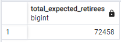

# pewlett-hackard-analysis
Performing analysis on internal management sample data. 

## Overview of Project

### Purpose
To analyze employee data from a business to help prepare for an upcoming 'silver tsunami'. Specifically, by
- determining the number of retiring employees per title,
- identifying employees that are eligible to participate in a mentorship program.

## Results
- The [retirement_titles.csv](data/retirement_titles.csv) file is not very useful. 
	- It has many extraneous entries, likely from employees who have gotten promotions, shuffled departments, or simply left the company. 
	- However, it was a good starting point for further analysis which led to other helpful .csv files.
- The [unique_titles.csv](data/unique_titles.csv) file appears useful on its own. 
	- It is a clean list of current employees that are likely to retire as they were born between 1952 and 1955. 
	- Still not very helpful at a glance due to it being thousands of lines long. 
	- Good basis for further analysis. 
- The [retiring_titles.csv](data/retiring_titles.csv) file is useful at a glance. 
	- It shows the number of potential retirees, sorted by their titles. 
	- Quickly shows how much of the workforce needs to be replaced at each level of the company. 
- The [mentorship_eligibility.csv](data/mentorship_eligibility.csv) file appears as useful as the unique_titles.csv file was.
	- It is a clean list of experienced employees born in 1965 who are likely ready to take on additional responsibilities in the wake of the 'silver tsunami'.  
	- Not useful at a glance due to being thousands of lines long. 
	- Further analysis required to make solid conclusions. 

## Summary
- How many roles will need to be filled as the "silver tsunami" begins to make an impact?

	
	
	- As shown in the prior tables, it is expected that a total of 72,458 roles need to be filled. 
		- The majority of these roles are "Senior Engineers" or "Senior Staff" which will be particularly difficult to replace. 

- Are there enough qualified, retirement-ready employees in the departments to mentor the next generation of Pewlett Hackard employees?

	
	- As shown in the prior table, the company is not close to filling in the required roles based on the prospective survey of mentorship-ready employees. 
	- It is recommended to either expand the age and experience range for the mentorship program or look outside the company, perhaps delegating the responsibilities of retiring workers to experienced contractors or smaller buisinesses. 
	
	
	- As shown in the prior table, by expanding the mentorship eligibility age demographic from a one year range(born in 1962/exactly 57 years old) to a four year range(born between 1962 and 1965/between 57 and 60 years old), the company can easily source enough Managers, Technique Leaders, Assistant Engineers, normal Engineers and basic Staff for their mentorship program. However, for the Senior level positions, the range will need to be expanded further, or other measures need to be taken.
		- It is out of scope of this analysis to make conclusions or speculations about the efficacy of outsourcing these empty roles. 

